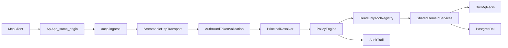

# MCP Implementation Master Plan (Technical Blueprint)

## Purpose

Define **how** to implement Durabull's hosted MCP server end-to-end, with concrete architecture, auth/tokening, permission boundaries, tool contracts, and validation strategy.

This document is the technical source of truth for implementation details.  
Use `tasks/mcp-pr-execution-playbook.md` for sequencing and handoff execution.
Security architecture baseline and threat model are anchored in `docs/adr/0001-mcp-security-architecture.md`.

---

## Hosting and deployment model (authoritative)

Durabull ships MCP on the **same origin and same deployable** as the main API + web app (single Render web service, single Docker entrypoint, one exposed port).

### Public URL map (production example)

| Path | Purpose | Handler |
| --- | --- | --- |
| `/api/*` | REST/RPC API | `apps/api` Hono routes |
| `/mcp` | MCP Streamable HTTP transport | `packages/mcp` mounted via thin `apps/api/src/mcp/` ingress in `createApiApp()` |
| `/ingest/*` | PostHog reverse proxy | `apps/api` (existing) |
| `/`, `/assets/*` | Web SPA/static | `apps/api/src/index.ts` static serving |

Example cloud URL: `https://app.durabull.io/mcp`

### What this means for implementers

- **Do:** implement MCP as a **logical module** under the API app (`apps/api/src/mcp/` ingress) with protocol logic in `packages/mcp`.
- **Do:** mount `/mcp` inside `createApiApp()` **before** SPA/static fallbacks (same precedence pattern as `/ingest/*`).
- **Do:** keep domain/job logic out of MCP route handlers; use shared services/DTOs (see §2.2).
- **Do not:** create or maintain a separate deployable `apps/mcp` process for phase 1.
- **Do not:** expose a second public port (for example `:3020`) for MCP in cloud/self-host images.
- **Do not:** add dual-process container runners solely for MCP unless explicitly re-approved in an ADR amendment.

### Canonical MCP resource URI (OAuth, PR-03+)

Derive from deployment config:

- `canonicalMcpResourceUri = ${APP_BASE_URL}/mcp` (no trailing slash unless spec requires)
- Audience/resource validation must match this URI in cloud (`https://app.durabull.io/mcp`).

### ADR alignment note

Deployable placement is documented in **ADR-0001** (`docs/adr/0001-mcp-security-architecture.md`, Accepted): unified API `/mcp` ingress, not standalone `apps/mcp`.

---

## Agent Startup Checklist (Mandatory)

Every incoming agent must complete this before writing code.

### A) Context Sync

- [ ] Read this entire file: `tasks/mcp-implementation-master-plan.md`.
- [ ] Read execution sequencing file: `tasks/mcp-pr-execution-playbook.md`.
- [ ] Open the active PR record in the playbook ledger and confirm current PR target.
- [ ] Confirm branch is the intended PR branch and based on latest `main`.
- [ ] Confirm whether a Linear issue is linked for the active PR.

### B) Scope Lock

- [ ] Copy the active PR section's objective and exit criteria into working notes.
- [ ] List exactly which checklist items are in-scope for this PR.
- [ ] List explicitly out-of-scope items and defer them.
- [ ] Confirm no phase-2 write/destructive MCP tools are being introduced.

### C) Security Lock

- [ ] Verify auth assumptions (Better Auth base + OAuth scoped bearer for MCP).
- [ ] Verify tenant boundary requirements (org + connection checks on every op).
- [ ] Verify least-privilege scope requirements for each touched tool/path.
- [ ] Identify and include at least one negative auth/authz test for the PR.

### D) Validation Lock

- [ ] Define required test commands before coding.
- [ ] Define specific evidence to attach in PR description.
- [ ] Define rollback or mitigation for the changed area.

---

## Implementation Status Snapshot (2026-05-28)

- [x] Step 1 complete: MCP module + `/mcp` transport ingress on unified API app (PR-02 merged).
- [x] Step 2 complete: OAuth discovery + token validation middleware (PR-03 merged).
- [x] Step 3 complete: principal resolver + policy engine (PR-04 merged).
- [x] Step 4 complete: read-only diagnostic tool catalog (PR-05 merged).
- [x] Step 5 complete: redaction, rate limits, audit expansion, telemetry (PR-06 merged).
- [x] Step 6 complete: deployment docs, operator runbooks (PR-07 merged — PR #99).
- [x] Step 7 complete: GA closure artifacts (PR-08 — ADR, compliance, security closure, release checklist).
- [ ] §13 step 4 (optional): shared domain service adapters (`packages/mcp-domain`) — deferred; tools use API handlers (see §2.2).
- [ ] Operator gate: staging `mcp:e2e` + human security sign-off before production announcement (see `docs/mcp-ga-release-checklist.md`).

---

## First 10 Steps (Deterministic Startup Runbook)

1. Identify active PR ID from `tasks/mcp-pr-execution-playbook.md`.
2. Copy PR objective + deliverables + tests into scratch notes.
3. Run `git status --short --branch` and verify correct branch/upstream.
4. Diff against `main` to understand current stack context.
5. Read all files listed under the active PR's File Targets.
6. Trace touched codepaths for auth, org scope, connection scope, and redaction.
7. Write a mini test matrix (happy path + denial path + boundary path).
8. Implement smallest vertical slice that satisfies one deliverable completely.
9. Run tests/lint/typecheck for touched packages and capture outputs.
10. Update playbook ledger entry with what changed + evidence + handoff notes.

If any step cannot be completed, mark PR status as `blocked` in the ledger and document why.

---

## Anti-Drift Protocol

Use this protocol to prevent agents from diverging from intended scope.

### Drift Triggers

Treat these as drift and stop to re-scope:

- touching files outside active PR scope without justification
- introducing write/destructive capability in phase 1
- adding new scopes not defined in this plan without design update
- skipping negative auth/authz tests
- putting domain/BullMQ logic directly inside MCP Hono handlers instead of shared services (route-coupled MCP logic)
- introducing a standalone `apps/mcp` deployable, second public MCP port, or dual-process Docker entrypoint for phase 1

### Drift Response

When drift is detected:

1. Stop coding.
2. Record drift in playbook ledger under current PR.
3. Re-map work to active PR checklist items.
4. Move true overflow work to next PR's handoff notes.
5. Resume only after scope is back inside PR boundaries.

---

## 1) Product Scope and Guardrails

### 1.1 Phase 1 Product Surface

Ship a remote, hosted MCP server that supports read-only diagnostics:

- jobs
- failures
- logs
- stacktraces
- queue metrics
- worker state
- composed failure explanation

No mutation tools in phase 1.

### 1.2 Hard Guardrails

- No destructive tool registration in phase 1.
- Read-only mode enforced in code and config.
- Per-request authz required on every MCP request.
- Tenant boundary checks (org + connection) on every domain operation.

---

## 2) Current System Reuse Strategy

### 2.1 Reuse Existing Durabull Domain Logic

Durabull already implements job/failure/log operations in API and BullMQ layers:

- `apps/api/src/routes/jobs.ts`
- `apps/api/src/routes/queues.ts`
- `apps/api/src/lib/bullmq-metrics.ts`
- `apps/api/src/lib/alert-monitor.ts`
- `apps/api/src/lib/alert-notifier.ts`
- DAL alert repositories in `packages/dal/src/repositories/*`

### 2.2 Extraction/Adapter Plan

Avoid coupling MCP to HTTP route handlers. Extract shared logic into a reusable service layer (or adapters) consumed by both API and MCP:

- `packages/mcp-domain` (new) or `apps/api/src/lib/domain/*` (intermediate)
- Inputs are typed DTOs, not Hono contexts
- Outputs are typed objects with normalized errors

Target interfaces:

- `QueueReadService`
- `JobReadService`
- `FailureReadService`
- `DiagnosticsService`

---

## 3) Target Runtime Architecture

### 3.1 Runtime placement (phase 1)

- **Deployable:** existing `apps/api` process (also serves web static/SPA in production).
- **MCP module path:** `packages/mcp` (transport, tools, auth/policy in later PRs) with thin mount at `apps/api/src/mcp/`.
- **Ingress mount:** `createApiApp()` in `apps/api/src/app.ts` at `/mcp`.
- **Shared packages:** domain/auth primitives in `packages/*` (and optional `packages/mcp-domain` later), not duplicated in a second app.

### 3.2 Why API ingress (not a separate `apps/mcp` app)

- Cloud (Render) and self-host Docker use **one web service / one port** today.
- Same-origin MCP (`/mcp`) simplifies OAuth resource URI, operator docs, and TLS/ingress.
- Matches existing pattern for non-API routes on the API app (`/ingest/*` proxy).
- Independent MCP scaling remains a **future option** behind a gateway; do not build it in phase 1.

### 3.3 Module boundary rules (still required)

- MCP transport/auth/policy code lives in `packages/mcp/*`; `apps/api/src/mcp/` is a thin ingress mount only (PR-03+ auth wiring at API boundary).
- MCP tools call shared domain services; they do not import Hono `Context` into domain layers.
- API REST routes and MCP tools must share tenancy checks and redaction utilities.

---

## 4) MCP Protocol and Transport Implementation

## 4.1 SDK/Transport Choice

- Use official MCP TypeScript SDK streamable HTTP support
- Support `GET` and `POST` MCP endpoints
- Start with stateful transport if resumability is needed; otherwise stateless

### 4.2 Required HTTP Security Behavior

- Host header validation enabled on `/mcp` (allow `localhost` dev hosts + hostname derived from `APP_BASE_URL`)
- Strict CORS allowlist on `/mcp` (no wildcard with credentials when credentials are used)
- Request size limits
- Timeouts and cancellation propagation

### 4.3 Required MCP Capability Surface

- `tools/list`
- `tools/call`
- `resources/list` (optional phase 1)
- `resources/read` (optional phase 1)

Do not expose prompts/sampling unless explicitly needed.

---

## 5) Authentication and Tokening Model

## 5.1 Identity Foundation

Use existing Better Auth (`better-auth`) for:

- user identity
- org membership context
- session lifecycle

Layer OAuth 2.1 token-based auth for MCP remote transport.

### 5.2 Token Classes

1. Delegated user tokens
   - principal: user
   - org context: asserted and verified
2. Service account tokens
   - principal: machine/service account
   - org-scoped
   - explicit scope bindings

### 5.3 OAuth/MCP Compliance Requirements

- Protected Resource Metadata (RFC9728)
- `WWW-Authenticate` challenge with resource metadata discovery
- Authorization Server Metadata (RFC8414)
- Authorization Code + PKCE (for delegated user clients)
- Resource Indicators (RFC8707) in auth/token requests
- audience/resource validation on every token

### 5.4 Token Validation Rules (Per Request)

- signature/issuer valid
- token not expired/revoked
- audience/resource matches MCP server canonical URI (`${APP_BASE_URL}/mcp`)
- required scope present
- principal and org active

Failure semantics:

- `401` for missing/invalid token
- `403` for insufficient scope/permissions

---

## 6) Authorization and Policy Engine

## 6.1 Authorization Layers

1. Transport auth (bearer token)
2. Principal resolution
3. Scope check (tool-level)
4. Org membership check
5. Connection ownership check
6. Optional field-level redaction policy

### 6.2 Scope Taxonomy (Phase 1)

- `mcp:discover`
- `mcp:jobs:read`
- `mcp:failures:read`
- `mcp:logs:read`
- `mcp:diagnostics:read`

Reserved for phase 2 write controls:

- `mcp:jobs:retry`
- `mcp:jobs:remove`
- `mcp:queues:pause`
- `mcp:queues:purge`

### 6.3 Policy Decision Contract

Each tool call produces a decision record:

- principal id/type
- org id
- connection id
- tool name
- required scopes
- granted/denied
- denial reason
- correlation id

---

## 7) Data Model Additions (DAL)

Add tables/entities for machine auth and policy:

- `mcp_service_account`
- `mcp_service_account_secret` (hash only, never plaintext storage)
- `mcp_policy_binding` (principal->scopes/tools constraints)
- `mcp_token_revocation` (if opaque token strategy)
- `mcp_audit_event`

Rules:

- secrets hashed with modern password/hash strategy
- rotation supported
- revocation immediate on disabled principal
- all records org-scoped

---

## 8) MCP Tool Catalog (Phase 1) and Contracts

All tools require:

- strict Zod input schema
- bounded pagination
- normalized error envelope
- read-only annotations

### 8.1 Tool: `list_connections`

Input:

- `cursor?`
- `pageSize?` (max 100)

Output:

- list of accessible connection descriptors (no secret URLs)
- next cursor

### 8.2 Tool: `list_queues`

Input:

- `connectionId`
- `cursor?`, `pageSize?`

Output:

- queue names + status counts

### 8.3 Tool: `get_queue`

Input:

- `connectionId`
- `queueName`

Output:

- queue detail + count summary + pause state

### 8.4 Tool: `list_jobs`

Input:

- `connectionId`
- `queueName`
- filters: `status?`, `name?`, `jobId?`
- pagination

Output:

- normalized job summary list

### 8.5 Tool: `get_job`

Input:

- `connectionId`
- `queueName`
- `jobId`

Output:

- full safe job detail

### 8.6 Tool: `get_job_logs`

Input:

- `connectionId`, `queueName`, `jobId`
- `cursor?`, `pageSize?` max 100

Output:

- ordered log lines + pagination token

### 8.7 Tool: `get_job_stacktraces`

Input:

- `connectionId`, `queueName`, `jobId`
- pagination

Output:

- attempt-indexed stacktrace entries

### 8.8 Tool: `get_failure_events`

Input:

- `connectionId`
- optional `queueName`, `jobId`, `status`
- offset/limit

Output:

- alert/failure event records with safe context

### 8.9 Tool: `get_queue_metrics`

Input:

- `connectionId`, `queueName`
- optional `windowMinutes`

Output:

- completed/failed windows, rates, streaks

### 8.10 Tool: `get_workers`

Input:

- `connectionId`
- optional queue filter

Output:

- worker snapshots

### 8.11 Tool: `explain_job_failure`

Input:

- `connectionId`, `queueName`, `jobId`

Output:

- composed narrative:
  - failed reason
  - attempt timeline
  - top signal from stacktrace/logs
  - alert context linkage
  - confidence flags

Implementation note:

- Deterministic summary, not LLM-dependent.
- Keep summary traceable back to source fields.

---

## 9) Redaction and Data Safety

### 9.1 Redaction Policy

Never return:

- Redis URLs/secrets
- known credential patterns in logs
- unsafe raw payload fields when policy marks as sensitive

Return:

- redacted placeholders
- redaction metadata count for transparency

### 9.2 Sensitive Field Strategy

- Central sanitizer utility
- Shared denylist + optional per-tool allowlist
- snapshot tests for redaction regressions

---

## 10) Reliability and Operational Controls

### 10.1 Rate Limits

- per principal
- per tool
- burst + sustained windows
- shared backend for multi-replica deployments (**phase 2** — phase 1 uses in-memory per-process limits)

### 10.2 Timeouts and Backpressure

- per tool timeout budgets
- server-side cancellation if client disconnects
- bounded concurrent calls per principal

### 10.3 Observability

- structured logs with correlation ids
- metrics:
  - auth failures
  - policy denies
  - tool latency/error rates
  - redaction counts

### 10.4 Audit Trail

Audit event on every tool call:

- who
- what tool
- resource target
- decision
- input hash
- response class

---

## 11) Cloud and Self-Hosted Deployment

## 11.1 Cloud Hosted (Render and similar)

- **Single web service** for API + web + MCP (existing Durabull deployable).
- Public MCP endpoint: `{APP_BASE_URL}/mcp` (for example `https://app.durabull.io/mcp`).
- No separate Render service or second public port for MCP in phase 1.
- Managed secrets and HTTPS at platform ingress (same as API).
- MCP-specific rate limits and auth middleware apply on `/mcp` routes only.
- Autoscaling targets the unified service; use shared rate-limit backend when multi-replica.

### 11.2 Self-Hosted

- Same single-container / single-process model as cloud (API entrypoint only).
- MCP available at `{APP_BASE_URL}/mcp` on the published app port (default `3000`).
- Do not publish a separate `MCP_PORT` in compose unless running a deprecated experimental layout.
- MCP is always available at `{APP_BASE_URL}/mcp` when the API process runs (no separate enable flag in phase 1).
- default read-only mode on
- explicit operator opt-in for future write scopes (phase 2)
- Hardening guidance:
  - TLS at reverse proxy
  - private network placement for Redis/Postgres
  - secret rotation cadence
  - Host header allowlist must include operator `APP_BASE_URL` hostnames

---

## 12) Test Strategy and Quality Gates

## 12.1 Unit Tests

- scope matching
- policy decision logic
- sanitizer/redaction behavior
- DTO validation

### 12.2 Integration Tests

- MCP transport lifecycle via `createApiApp()` at `/mcp` (same port as API)
- OAuth discovery and challenge flow on app origin
- authorized read tool calls
- forbidden cross-org calls
- SPA/static fallback does not intercept `/mcp`

### 12.3 Security Tests

- wrong audience token rejected
- missing scope rejected with correct semantics
- revoked principal rejected
- token replay/expiry behavior

### 12.4 Performance Tests

Deferred post-GA (not a phase-1 merge gate). Track via draft SLOs in `docs/mcp-ga-release-checklist.md` after staging soak:

- log-heavy pagination
- stacktrace retrieval
- concurrent read tool traffic

### 12.5 Acceptance Gate

Do not mark phase complete until:

- all tests green
- no critical/high open security findings
- staging smoke passes for delegated + service-account flows

---

## 13) Implementation Order (Technical Dependency Graph)

1. establish MCP module + `/mcp` transport ingress on `apps/api` (ping smoke tool)
2. implement auth discovery and token validation middleware on `/mcp` (+ PRM at well-known paths)
3. add principal resolver + policy engine
4. extract/shared domain service adapters (API + MCP consumers)
5. ship read tools incrementally
6. add redaction + rate limiting + audit
7. deployment + runbooks + final compliance verification (single-service docs; remove any `apps/mcp` / dual-process leftovers)

### 13.1 Historical: legacy `apps/mcp` scaffold (completed PR-02)

Completed on `main`: transport in `packages/mcp/`, thin mount at `apps/api/src/mcp/`, no dual-process Docker MCP port. ADR-0001 reflects unified placement.

---

## 14) Explicit Non-Goals (Phase 1)

- no destructive tool support
- no arbitrary Redis key read/delete via MCP
- no automatic remediation actions
- no broad wildcard scopes

---

## 15) Delivery Sign-Off Checklist

- [x] MCP transport spec behavior validated — see `docs/mcp-ga-compliance-checklist.md`
- [x] OAuth/resource audience validation enforced
- [x] least-privilege scopes implemented
- [x] org and connection boundary checks enforced
- [x] tool outputs sanitized/redacted
- [x] audit logging operational
- [x] cloud and self-host docs complete (unified deployment; `{APP_BASE_URL}/mcp`)
- [x] sequential PR playbook updated with actual PR links/status
- [x] ADR-0001 published at `docs/adr/0001-mcp-security-architecture.md`
- [ ] staging `mcp:e2e` + production release checklist executed per `docs/mcp-ga-release-checklist.md`
